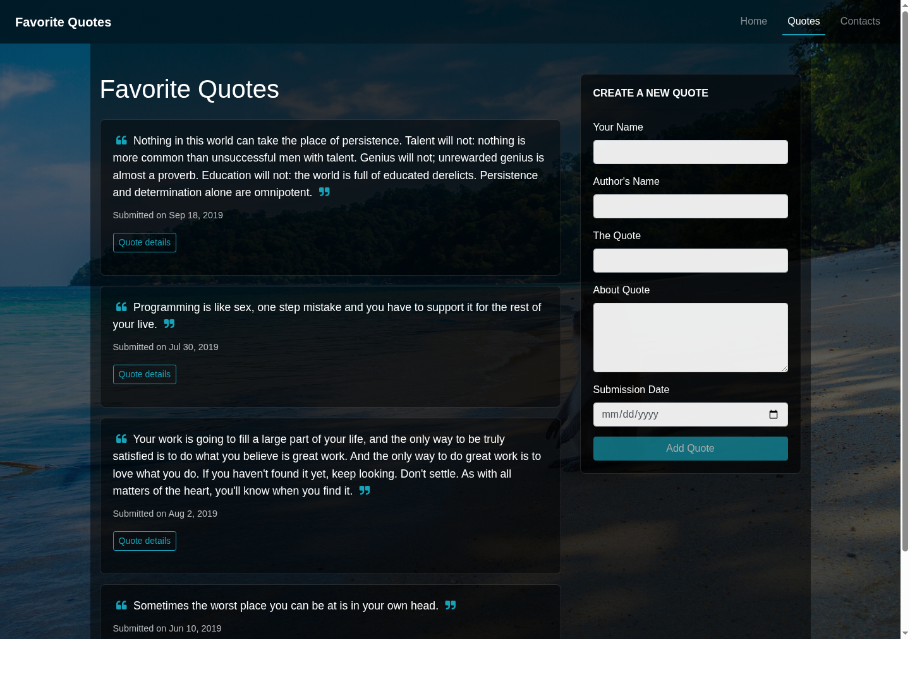

# Favorite Quotes

Favorite Quotes is an Angular app for collecting, browsing, and voting on motivational quotes. Users can add a quote, include author and submitter details, view quote metadata, and like or dislike quotes.

>> A Moringa School simple coursework project



## Features

- Browse a seeded list of favorite quotes.
- Add a new quote with author, submitter, description, and submission date.
- View extra details for each quote.
- Like, dislike, and remove quotes.
- Navigate between Home, Quotes, and Contacts pages.

## Tech Stack

- Angular 21
- TypeScript 5.9
- Bootstrap 4
- Font Awesome
- Karma and Jasmine for tests

## Getting Started

Install dependencies:

```bash
npm install
```

Start the development server:

```bash
npm start
```

Open `http://localhost:4200/` in your browser.

## Build

Create a production build:

```bash
npm run build
```

The build output is written to `dist/`.

## Tests

Run unit tests:

```bash
npm test
```

For a headless Chromium run, use:

```bash
CHROME_BIN=chromium-browser npm test -- --watch=false --browsers=ChromeHeadless
```

## Deployment

Live site:

https://paulwamaria.github.io/Quotes/

## License

Copyright (c) 2019 Paulwamaria
